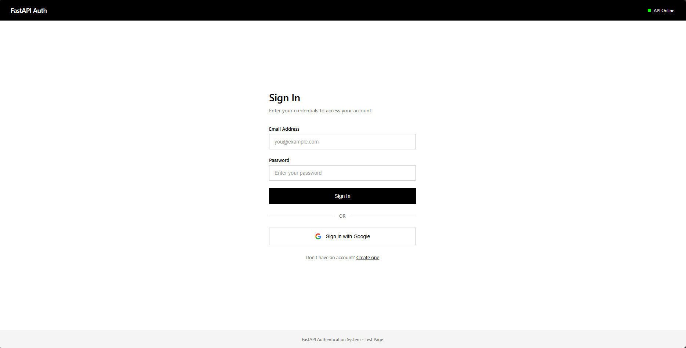

# FastAPI Authentication System

Production-ready authentication API built with FastAPI, PostgreSQL, and async Python.



## Features

- JWT authentication with access/refresh token rotation
- Google OAuth 2.0 with account linking
- Argon2 password hashing
- Rate limiting (in-memory)
- Brute-force protection with account lockout
- Alembic database migrations

## Requirements

- Python 3.12+
- PostgreSQL 14+

## Installation

```bash
# Clone repository
git clone <repository-url>
cd auth-fast-api-template

# Create virtual environment
uv venv
uv sync

# Configure environment
cp .env.example .env
# Edit .env with your settings

# Run migrations
alembic upgrade head

# Start server
uv run uvicorn app.main:app --reload
```

## Configuration

All configuration is done via environment variables. See `.env.example` for available options.

Required variables:

| Variable | Description |
|----------|-------------|
| `DATABASE_URL` | PostgreSQL connection string |
| `JWT_SECRET_KEY` | Secret for JWT signing (min 32 chars) |

Optional variables for Google OAuth:

| Variable | Description |
|----------|-------------|
| `GOOGLE_CLIENT_ID` | OAuth client ID |
| `GOOGLE_CLIENT_SECRET` | OAuth client secret |

## Project Structure

```
app/
  api/v1/endpoints/   # API endpoints
  core/               # Config, security, exceptions
  db/                 # Database session and base
  middleware/         # Rate limiting, security headers
  models/             # SQLAlchemy models
  schemas/            # Pydantic schemas
  services/           # Business logic
  main.py             # Application factory
alembic/              # Database migrations
static/               # Static files (test.html)
```

## Test Page

The API includes a built-in test page at `/test` for interactive testing of authentication flows.

```bash
# Start server
uv run uvicorn app.main:app --reload

# Open http://localhost:8000/test in browser
```

## API Endpoints

### Authentication

```
POST /api/v1/auth/register     Register new user
POST /api/v1/auth/login        Login with email/password
POST /api/v1/auth/logout       Logout (revoke refresh token)
POST /api/v1/auth/logout-all   Logout from all devices
POST /api/v1/auth/refresh      Refresh access token
POST /api/v1/auth/change-password
```

### Password Reset

```
POST /api/v1/auth/password-reset/request
POST /api/v1/auth/password-reset/confirm
```

### Google OAuth

```
GET  /api/v1/auth/google           Initiate OAuth flow (Optional: ?redirect_to=URL)
GET  /api/v1/auth/google/callback  OAuth callback
DELETE /api/v1/auth/google/unlink  Unlink Google account
```

### Users

```
GET   /api/v1/users/me    Get current user
PATCH /api/v1/users/me    Update current user
DELETE /api/v1/users/me   Delete account
```

### Health

```
GET /api/v1/health        Health check
GET /api/v1/health/ready  Readiness check
```

## Authentication Flow

1. Register or login to receive access and refresh tokens
2. Include access token in requests: `Authorization: Bearer <token>`
3. When access token expires, use refresh token to get new tokens
4. Refresh tokens are rotated on each use (old token is invalidated)

## Database Migrations

```bash
# Create new migration
alembic revision --autogenerate -m "description"

# Apply migrations
alembic upgrade head

# Rollback
alembic downgrade -1
```

## Google OAuth Setup
1. Create project in Google Cloud Console
2. Enable Google+ API
3. Create OAuth 2.0 credentials (Web application)
4. Add authorized redirect URI: `http://localhost:8000/api/v1/auth/google/callback`
   - **Important**: You must add the callback URL for **every environment** where the API runs (e.g. `https://your-domain.com/api/v1/auth/google/callback`). The system dynamically generates the redirect URI based on the request host.
5. Copy Client ID and Secret to `.env`

## Frontend Integration

The API is designed to work with separate frontends (React, Vue, Mobile, etc.) running on different domains.

### OAuth Login Flow
1. Frontend redirects user to: `GET /api/v1/auth/google?redirect_to=https://your-frontend.com/dashboard`
2. User logs in with Google.
3. API redirects back to: `https://your-frontend.com/dashboard#access_token=...&refresh_token=...`
4. Frontend extracts tokens from the URL fragment.

### CORS
Enable CORS for your frontend domain in `.env`:
`CORS_ORIGINS=http://localhost:3000,https://your-frontend.com`

## Security

- Passwords hashed with Argon2
- JWT tokens with configurable expiration
- Refresh token rotation prevents replay attacks
- Account lockout after failed login attempts
- Rate limiting on auth endpoints
- Security headers (CSP, HSTS, X-Frame-Options)

## Development

```bash
# Run tests
pytest

# Type checking
mypy app

# Linting
ruff check app
ruff format app
```

## License

MIT
